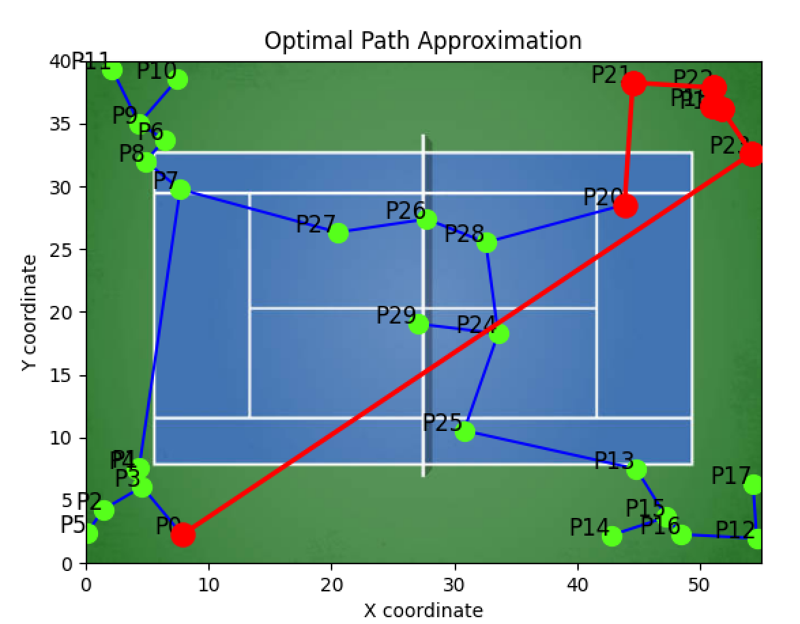

# TSM-tennis-application
This program approximates the optimal path through tennis balls scattered on a tennis court using Prim's algorithm and depth-first search. It includes a graphical user interface (GUI) built with Tkinter for easy interaction.

Example situation: 
